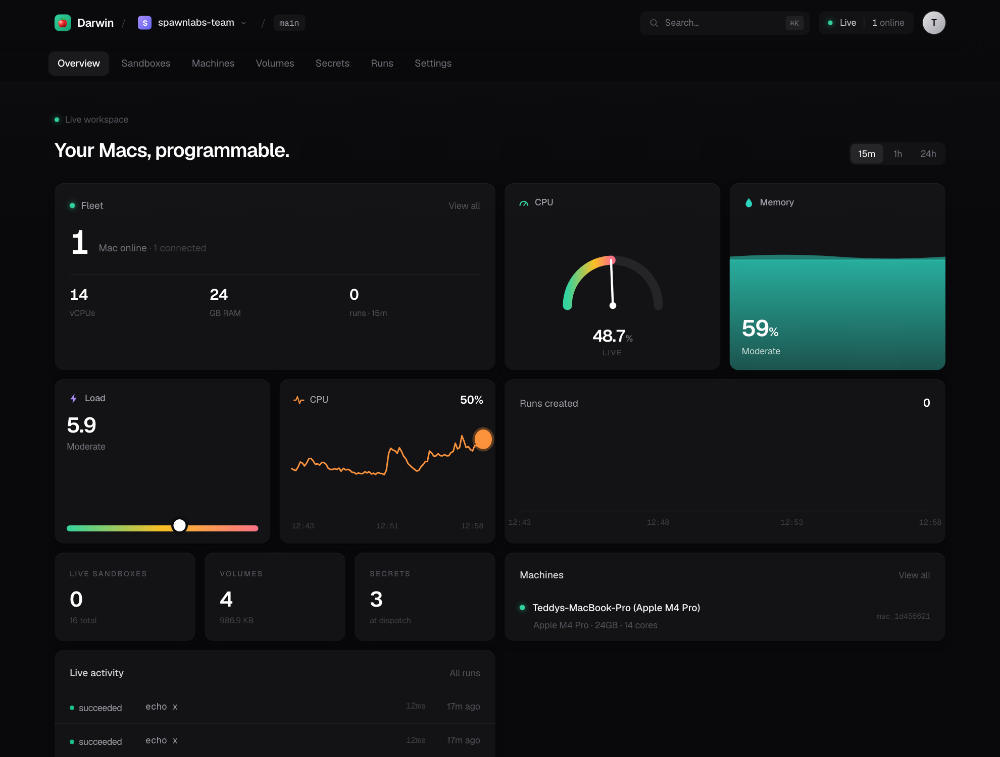
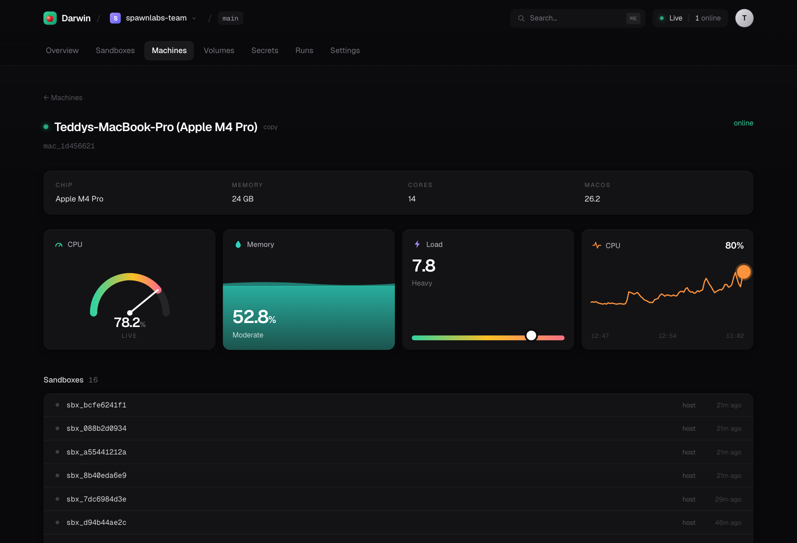
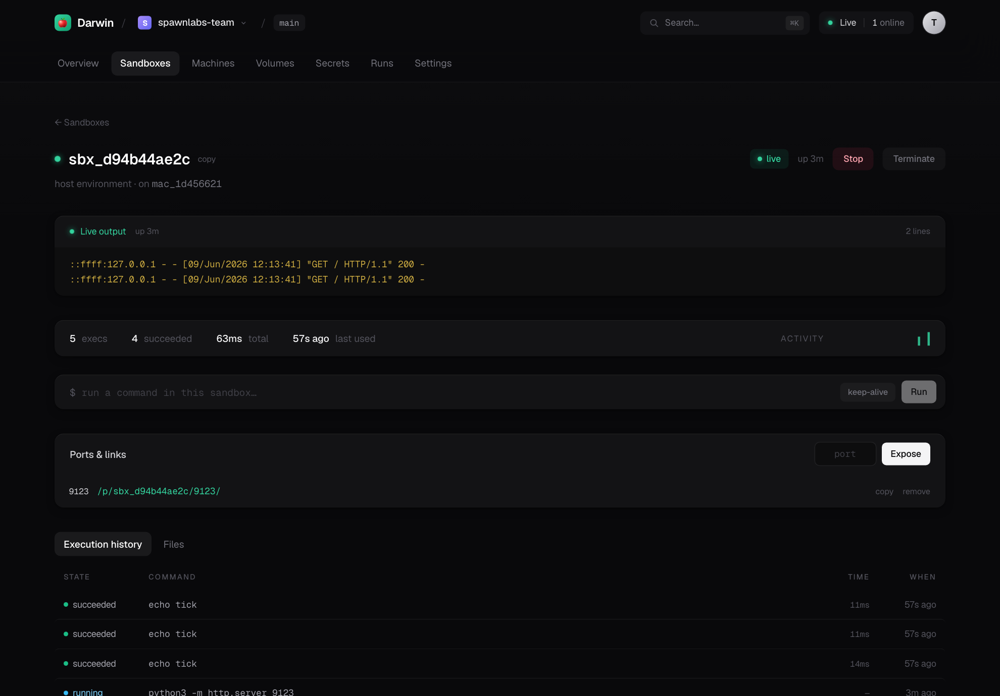
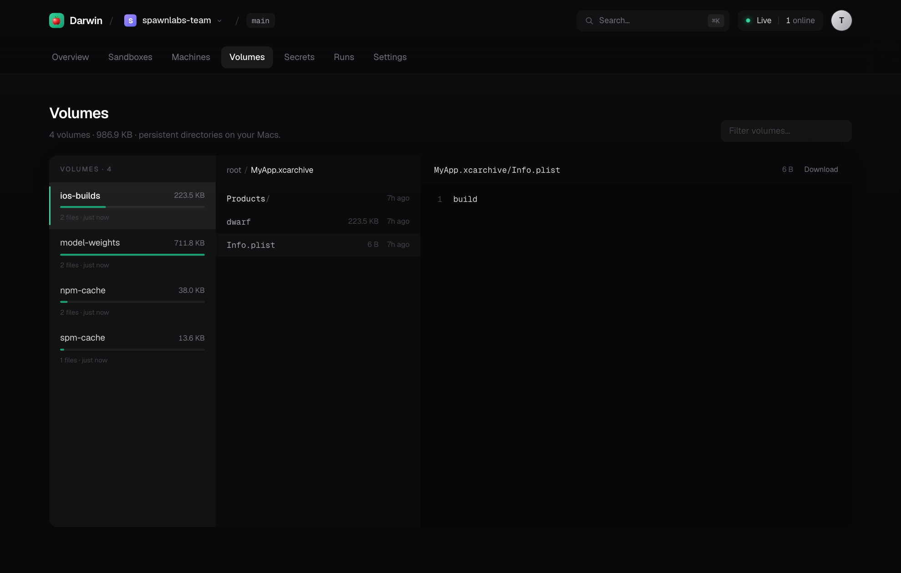

<div align="center">

# 🍎 Darwin Cloud

**Connect your Mac to the internet and turn it into a programmable runtime.**

*Modal, for Macs.*

<br/>



</div>

---

Darwin makes any Mac you own into a runtime that agents, SDKs, CLIs, cron jobs,
and applications can execute against from anywhere. Install the daemon, sign in,
and your Mac becomes an API.

```python
import darwin as dc

mac = dc.mac()
result = mac.run("xcodebuild -scheme MyApp build")
print(result.stdout)
```

Nobody cares about SSH. Nobody cares about Tailscale. Nobody cares about machine
management. **They just have a Mac.**

## The mental model

It's not "rent Macs." It's not "manage servers." It's not "a CI system."

> **Every Mac becomes an API.**

The developer surface intentionally echoes Modal, so the mental model transfers
directly — `App`, `Image`, `Volume`, `Sandbox` — except the runtime is *your
Mac*, and Apple's licensing makes that something Modal/AWS structurally can't
offer as dense rented cloud. Your Mac, already licensed, is the cloud.

## Architecture

Three small pieces. Your Mac never opens an inbound port; the daemon dials home
over a persistent WebSocket (the same NAT-traversal pattern as GitHub Actions
runners, Tailscale, and Cloudflare Tunnel), and commands are pushed back down
that socket.

```
┌─────────────┐   REST: start a job    ┌──────────────┐   WS (agent dials home)  ┌─────────────┐
│  Python SDK │ ───────────────────►   │ Control Plane│ ◄──────────────────────  │ Mac Daemon  │
│   + CLI     │ ◄═══ WS: stream logs ══ │  (FastAPI)   │  ═══ exec / stdout ════► │ (executor)  │
└─────────────┘                        └──────────────┘                          └─────────────┘
   dc.mac().run()                      sqlite + fan-out                            your real Mac
```

The control plane is deliberately tiny — it remembers *who owns what* and job
status. **Volumes, sandboxes, images, and caches never leave the Mac.** The Mac
is the cloud.

## Quickstart

```bash
pip install darwin-cloud      # or: uv tool install darwin-cloud
```

### Self-host in one command

`darwin host` turns this Mac into a self-hosted Darwin: control plane + the full
web dashboard + a secure public link + this Mac as a compute node — one process,
one SQLite file, no managed infrastructure.

```bash
darwin host
# ✓ Darwin host is live
#   Dashboard   https://<you>.trycloudflare.com   (or a permanent Tailscale Funnel link)
#   Host token  darwin_sk_…
#   Add a Mac   darwin connect https://… darwin_sk_…
```

Open the link, paste the token once, and you're in. Other Macs join the pool with
`darwin connect <link> <token>`. For a **permanent** link, run `darwin host setup`
once to enable Tailscale Funnel (free).

### Or drive it from Python

```python
import darwin as dc

mac = dc.mac()
print(mac.run("sw_vers").stdout)
print(mac.run("xcodebuild -version").stdout)
```

## The SDK

### Run commands

```python
mac = dc.mac()

# blocking, returns a Result(exit_code, stdout, stderr, duration_ms)
r = mac.run("swift build", check=True)

# stream output live to your terminal
mac.run("npm test", stream=True)

# iterate output yourself
for stream, line in mac.stream("xcodebuild build"):
    handle(line)
```

### Images — environment recipes resolved on the Mac

```python
mac.run("xcodebuild build", image=dc.Image.xcode("26"))   # selects DEVELOPER_DIR
mac.run("node --version",   image=dc.Image.node("22"))     # pins via mise
mac.run("python script.py", image=dc.Image.python("3.13"))
```

On a Mac an Image isn't a container — it's a recipe that selects the right Xcode
(`DEVELOPER_DIR`, never clobbering concurrent jobs) or runtime (`mise`). If a
toolchain isn't installed, the command still runs against the host and Darwin
tells you what it would have pinned.

### Volumes — persistent directories on the Mac

```python
vol = dc.Volume.from_name("ios-builds")
# Reachable as ./builds (relative to the working dir) and via the env var.
mac.run("xcodebuild archive -archivePath $DARWIN_VOLUME_IOS_BUILDS/App.xcarchive",
        volumes={"builds": vol})
```

On a bare Mac there's no container, so a volume is mounted under the working
directory at the mount name *and* exposed as an absolute path through
`$DARWIN_VOLUME_<NAME>` — both unambiguous. (Absolute `/workspace`-style mounts
arrive with the Tart VM backend.)

### Sandboxes — isolated, persistent workspaces

```python
with dc.Sandbox.create(image="xcode:26") as sbx:
    sbx.exec("git clone https://github.com/me/app .")
    sbx.exec("xcodebuild -scheme App build", check=True)
```

Each sandbox is its own directory tree with redirected `HOME`/`TMPDIR` and
toolchain caches, its own process session (so timeouts kill the whole tree), and
an optional `sandbox-exec` write-fence. Files persist between `exec` calls.

### Expose a server — a sandbox becomes a URL

```python
sbx.spawn("python -m http.server 8000", keep_alive=True)
url = sbx.expose(8000)            # → https://<you>.trycloudflare.com/p/<sbx>/8000/
```

Run a web app or API inside a sandbox and get a hittable public link. Requests
tunnel through the agent WebSocket — control plane → daemon → the sandbox's
`localhost:port` — so it works behind NAT with no inbound ports. With a wildcard
domain you get named subdomains (`https://myapi.ports.yourdomain`).

### Apps & functions — run real Python on your Mac

```python
app = dc.App("builds")

@app.function(image=dc.Image.python("3.13"))
def inspect(target: str) -> dict:
    import platform
    return {"target": target, "ran_on": platform.node()}

@app.local_entrypoint()
def main():
    print(inspect.remote("release"))   # ships source, runs on the Mac
```

## The dashboard

`darwin host` serves a full web dashboard — bundled into the package as a static
build, served by the control plane (no Node.js at runtime). Live metrics, a
sandbox explorer with exposed ports, a deep file browser for volumes, secrets,
run history — all polling the same API the SDK and CLI use.

| | |
|:--:|:--:|
|  |  |
| *Per-Mac live gauges* | *Sandboxes — activity + exposed ports* |
|  | |
| *Volumes — a real file explorer* | |

## The CLI

```
darwin host               self-host: control plane + dashboard + public link
darwin host setup         enable a permanent Tailscale Funnel link
darwin connect <link> <token>   join another Mac to a host
darwin serve              run a bare control plane locally
darwin machines           list your connected Macs
darwin run -- <cmd>       run a command on a Mac (streams output)
darwin shell -c <cmd>     one-off command (SSH-equivalent)
darwin logs               recent jobs
darwin status             local configuration
darwin volume ls|create|rm
darwin image ls           toolchain images available on this Mac
darwin install            launchd LaunchAgent — stay online on login
darwin uninstall
```

## Isolation, honestly

The MVP isolates with per-sandbox directories, a clean allowlisted environment,
process-group teardown, and (when available) a `sandbox-exec` write-fence. This
is the right model for *trusted* code — the user owns the Mac and runs their own
builds — and it starts instantly.

The documented next tier is **Tart** VMs (Apple's Virtualization.framework, OCI
images, near-instant APFS copy-on-write clones) for true OS-level isolation, and
Apple's native `container` for Linux jobs on macOS 26. The `Image`/`Volume`/
`Sandbox` API is drawn so those become a backend swap, not an API change. See
[`DESIGN.md`](DESIGN.md) and [`ROADMAP.md`](ROADMAP.md).

## Apple licensing — the moat

Apple's macOS SLA limits virtualization to **2 VMs per physical Mac** and forbids
"service bureau / time-sharing." The BYO-Mac model sidesteps this: the Mac and
its macOS license belong to *you*, so Darwin runs as personal/dev use on hardware
you own — which is exactly what the license permits and what makes "Modal for
Macs" both accurate and hard to copy as a rented-fleet cloud.

## Build from source

```bash
git clone https://github.com/teddyoweh/darwin-cloud
cd darwin-cloud
uv venv && uv pip install -e ".[dev]"
uv run pytest                      # backend tests
./scripts/build_release.sh         # build the dashboard + wheel (with UI bundled)
```

The dashboard lives in `web/` (Next.js, static-exported). `scripts/build_release.sh`
exports it and bundles it into the wheel, so `pip install` ships the whole UI.

## Status

Works today, end-to-end: `darwin host` (control plane + bundled dashboard +
public tunnel + token auth), connect Macs, run commands, stream logs, mount
volumes, drive sandboxes, expose ports as URLs, run remote Python. See
[`ROADMAP.md`](ROADMAP.md) for what's next (self-hostable tunnel relay, Tart VM
backend, code-shipping for functions).

## License

Apache-2.0
